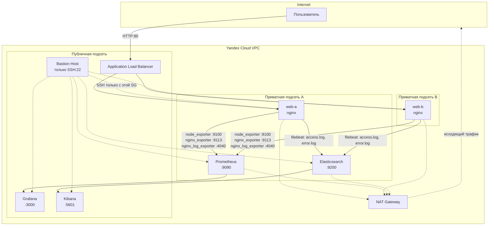

# Отказоустойчивая инфраструктура сайта в Yandex Cloud

Курсовой проект (Netology, «DevOps-инженер с нуля»). Инфраструктура полностью описана
кодом — Terraform (провижининг облачных ресурсов) + Ansible (конфигурация ПО на ВМ).

Обоснование ключевых архитектурных и технических решений — в [decisions.md](decisions.md).

---

## Архитектура



- Один VPC, три подсети (публичная + 2 приватные в разных зонах доступности)
- Приватные подсети: web-a, web-b, Prometheus, Elasticsearch — без входящего доступа из интернета
- Публичная подсеть: ALB, Grafana, Kibana — нужен прямой доступ пользователю/оператору
- NAT-шлюз даёт приватным ВМ исходящий доступ (обновления, скачивание бинарников)
- Bastion — единственная точка входа по SSH; все прочие security groups разрешают SSH только из SG бастиона

---

## Структура репозитория

```
coursework/
├── terraform/
│   ├── main.tf                  # подключение модулей
│   ├── outputs.tf                # прокидывание IP/ID наружу
│   └── modules/
│       ├── network/               # VPC, подсети, NAT, security groups
│       ├── compute/                # bastion, web-a/b, ALB
│       ├── monitoring/            # Prometheus + Grafana VMs
│       ├── logging/                # Elasticsearch + Kibana VMs
│       └── backup/                # расписание снепшотов
├── ansible/
│   ├── playbooks/site.yml
│   ├── inventory/hosts.yml        # генерируется скриптом, в git не хранится
│   └── roles/
│       ├── nginx/
│       ├── node_exporter/
│       ├── nginx_exporter/         # nginx-prometheus-exporter (stub_status)
│       ├── nginx_log_exporter/     # prometheus-nginxlog-exporter (парсинг access.log)
│       ├── prometheus/
│       ├── grafana/
│       ├── elasticsearch/
│       ├── kibana/
│       └── filebeat/
├── files/elastic/                 # .deb пакеты ELK (в .gitignore, см. decisions.md)
├── scripts/
│   ├── generate_inventory.sh      # генерация inventory из terraform output
│   └── download_elastic_debs.sh   # скачивание .deb пакетов Elastic
├── docs/
├── README.md
└── decisions.md
```

---

## Быстрый старт

```bash
# 1. Применить инфраструктуру
cd terraform
terraform init
terraform apply

# 2. Сгенерировать inventory из свежих IP
cd ..
./scripts/generate_inventory.sh

# 3. Проверить связность
ansible all -m ping

# 4. (только для логирования, один раз, нужен VPN — см. decisions.md)
./scripts/download_elastic_debs.sh

# 5. Развернуть всё ПО
ansible-playbook ansible/playbooks/site.yml
```

Точечный прогон отдельного слоя:
```bash
ansible-playbook ansible/playbooks/site.yml --limit <группа>
# группы: web, prometheus, grafana, elasticsearch, kibana
```

---

## Проверка по разделам задания

**Сайт (2 ВМ + ALB):**
```bash
curl -v http://<alb_public_ip>
```
Повторные запросы возвращают разный hostname в теле ответа — подтверждает балансировку.

**Мониторинг:** Grafana (`http://<grafana_public_ip>:3000`) — кастомный дашборд с
Utilization/Saturation/Errors по CPU/RAM/диску/сети, тресхолды 70/90%, плюс
`nginx_http_response_count_total`/`nginx_http_response_size_bytes`.
Prometheus (`http://<prometheus_ip>:9090/targets`) — все job'ы в статусе UP.

**Логи:**
```bash
curl -s http://<elasticsearch_internal_ip>:9200/_cat/indices?v
```
Индекс `nginx-logs-YYYY.MM.DD` с ненулевым `docs.count`. В Kibana
(`http://<kibana_public_ip>:5601`) — Data View `nginx-logs-*`, живые записи в Discover.

**Резервное копирование:**
```bash
yc compute snapshot-schedule get coursework-daily-snapshots
```
Ежедневно в 03:00 UTC, retention 7 дней, привязано ко всем дискам инфраструктуры.

---

## Известные ограничения

- Community-дашборд «Node Exporter Full» (Grafana.com ID 1860) не рендерит панели —
  несовместимость schemaVersion. Не блокер: все требуемые заданием метрики покрыты
  кастомным дашбордом с тресхолдами.
- Elasticsearch — single-node, без репликации (достаточно для учебного стенда).
- `xpack.security` отключен на всём ELK-стеке — см. обоснование в decisions.md.